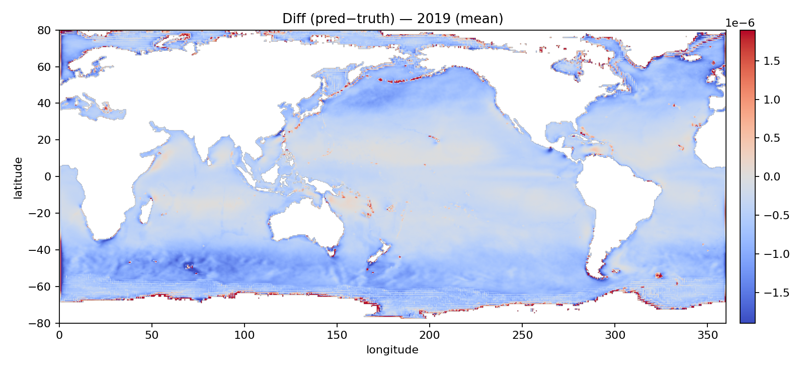

# nnwave-ml

A modular machine-learning pipeline for global WAVEWATCH III / air–sea wave
breaking research.  This is designed for a peer-review paper under review.

Authorship: Xiaohui Zhou (xiaohuizhou4work@gmail.com)

This package turns my research workflow into:

✔ reproducible  
✔ installable  
✔ callable from the command line (`nnwave-train-pointwise`, etc.)  
✔ importable from Python scripts and notebooks

It is designed for running at scale on HPC clusters with Dask + PyTorch DDP.

---

## 🌊 Pipeline Overview

The pipeline supports:

1. **Convert WW3 NetCDF → Zarr stores**  
2. **Generate ocean masks & cleaning**
3. **Compute ML feature/target scalers**
4. **Build temporal train/val/test splits**
5. **Train pointwise neural networks**
6. **Run distributed global predictions to NetCDF**

All steps are exposed as CLI tools via :
nnwave-convert-nc-to-zarr
nnwave-build-mask
nnwave-compute-scalers
nnwave-build-splits
nnwave-train-pointwise
nnwave-predict-pointwise


## 🚀 Example Usage

Prediction example:

```bash
nnwave-predict-pointwise \
  --zarr_glob "/data/zarr/ww3.2015.zarr" \
  --mask_root /data/prep \
  --scaler_json /data/prep/feature_scaler.json \
  --model /models/mlp/model.pt \
  --out_dir /predictions \
  --save_features hs cp U10
```

## Below is an example visualization produced using this package:

